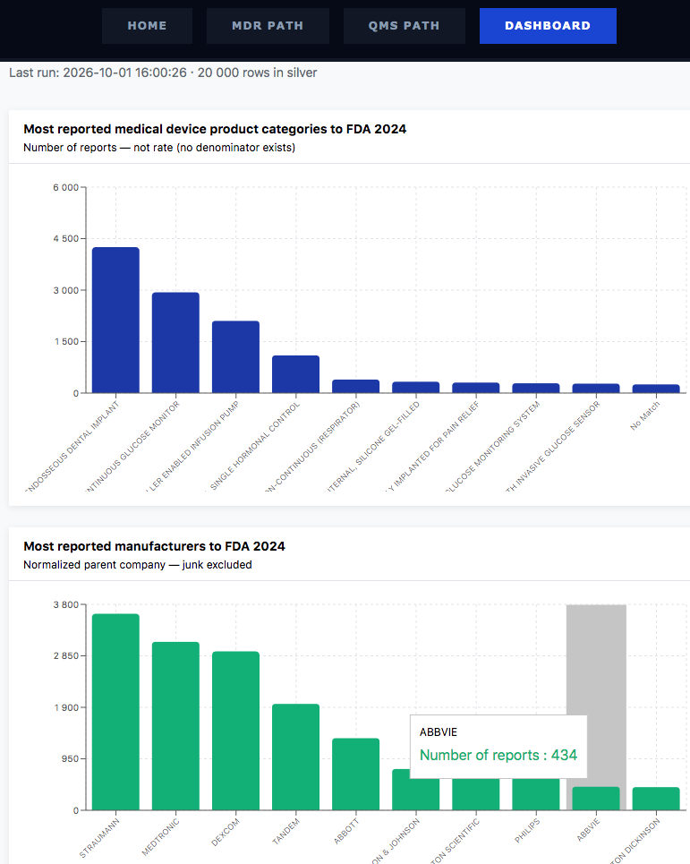

# PIPELINE.md — ETL Pipeline: Medallion Architecture
This document covers the process behind the [Aegis Compliance](./README.md) dashboard. 




It contains 
- I - STEPS IN CONDUCTING THE ANALYSIS &
- II - STEPS IN CONDUCTING THE PIPELINE


## I - STEPS IN CONDUCTING THE ANALYSIS

### STEP 1 - DEFINE THE RESEARCH QUESTION 
The purpose is to answer
| #  | Question | 
|---|---|
| Q1 | Which products have the most device reports in 2024? |
| Q2 | Which manufacturers have the most device reports in 2024? |

to help teams to detect what to focus on for a product. 


### STEP 2 - EXPLORE AVAILABLE FILES & STRUCTURE FROM THE DATABASE 
See [FDA's MAUDE database](https://www.fda.gov/medical-devices/medical-device-reporting-mdr-how-report-medical-device-problems/mdr-data-files#download)

| File | Description | 
|---|---|
| mdrfoi*.zip | Master data-file: Summary of all data files, event types, reporter |
| patientthru*.zip | Patient data-file: Information related to the patient(s) involved |
| foitext*.zip | Text data-file: Textual information from MEDWATCH |
| device*.txt | Device data-file: Information related to the device(s) involved |

All are string format, pipeline delimited

#### 2.1 EXPLORE TARGET FILE TO SELECT DATA FIELDS 

2.1.1 DOWNLOAD THE RAW FILE
```bash
mkdir -p medallion/data
cd medallion/data
curl -O https://www.accessdata.fda.gov/MAUDE/ftparea/device2024.zip
unzip device2024.zip
cd ../..
```

2.1.2 SELECT DATA FIELDS
```bash
head -n 1 medallion/data/DEVICE2024.txt | tr '|' '\n'
```

| Column | Role | 
|---|---|
| `MDR_REPORT_KEY` | Links this file to other MAUDE files. Can be duplicated.| 
| `DEVICE_SEQUENCE_NO`| Unique per unit in a report|
| `GENERIC_NAME`  | The generic common name of the medical device | 
| `DEVICE_REPORT_PRODUCT_CODE` | FDA product classification code (3 letters) | 
| `MANUFACTURER_D_NAME` | Company that manufactured the device | 


#### 2.2 EXPLORATORY DATA ANALYSIS (EDA) TO DISCOVER DATA QUALITY REQUIREMENTS FOR SILVER 
This EDA is on the full file, 2.6 M rows. 

```bash 
python medallion/analysis/eda_device.py
```

1. WHAT IS A ROW?  
```
rows: 2,629,410 | unique MDR_REPORT_KEY: 2,627,121 | duplicated (MDR_REPORT_KEY, DEVICE_SEQUENCE_NO): 33 | duplicated (one row): 31 
```
**Conclusion:**
- PK is `MDR_REPORT_KEY, DEVICE_SEQUENCE_NO` — 33 duplicate PKs found, unique in 99.999 % of rows → **S1**
- 31 of those are exact duplicates → **S2** Remove 31 identical rows on PK


2. MISSING VALUES (%) ? 
```
MDR_REPORT_KEY: 0.00 | DEVICE_SEQUENCE_NO: 0.00 | GENERIC_NAME: 0.02 | MANUFACTURER_D_NAME: 0.16 | DEVICE_REPORT_PRODUCT_CODE: 0.00
```
**Conclusion:** Handle missing
- GENERIC_NAME (0.02 %) **S3** and
- MANUFACTURER_D_NAME (0.16 %) **S4**


3. JUNK MANUFAKTURER NAMES? 
```
junk list: 1,065 | shorter than 2 chars: 15 | MPRI 34885 | UNK 537 | BD 113 | 0HP 21 | SERF 18 | . 12 | 000 5 | DSS 3 | BIOS 3 | REMI 3
```
**Conclusion:**
- Classify MPRI as junk or valid  **S5**
- Flag rows with junk manufacturer names **S6**

  

4. SAME COMPANY, MANY SPELLINGS (TOP 5) ? 
```
OLYMPUS: 43 different spellings, 55,957 rows | MEDTRONIC: 99 different spellings, 274,262 rows | ALCON: 20 different spellings, 11,719 rows | BOSTON SCIENTIFIC: 27 different spellings, 64,829 rows | ABBOTT: 95 different spellings, 90,271 rows
```
**Conclusion:** Normalize manufacturer names **S7**


5. ONE PRODUCT CODE, SEVERAL NAMES? 
```
codes: 2,206 | codes with more than 1 name: 1,402
```
**Conclusion:** Build canonical product name — product_code_dim with the most common GENERIC_NAME per DEVICE_REPORT_PRODUCT_CODE **S8**


6. CONCENTRATION?
``` 
top 10 codes = 65.5 % of rows | top 10 manufacturers = 55.0 % of rows
```
**Conclusion:** Add all 2 M rows of data for future steps


#### DATA LIMITATIONS
- Under-reporting of events
- Inaccuracies in reports
- Lack of verification that the device caused the reported event
- Lack of information about frequency of device use
- Nr of reports will be high where there are many products on the market, this is not risk


#### 2.3 - ANALYSIS METHOD
Aggregation + ranking, since kategorical and numerical data types


## II - STEPS IN CONDUCTING THE PIPELINE
### RESULTING FILE STRUCTURE
```
medallion
├── data
│   └── DEVICE2024.txt
├── analysis
│   └── eda_device.py
├── python
│   ├── bronze_ingest.py
│   ├── test_bronze_ingest.py
│   └── requirements.txt
│
└── sql
    ├── 01_create_tables.sql
    ├── 02_bronze.sql
    ├── 03a_seed_manufacturers.sql
    ├── 03b_silver.sql
    ├── 04_gold.sql
    └── 05_pipeline.sql             
```

### Pipeline Architecture & Data Flow
```
[ Source file ] 
       │
       ▼ (Ingestion via Python)
┌─────────────────────────────────────────┐
│ BRONZE LAYER (Raw & Immutable)          │
│ - Append-only storage in Supabase       │
│ - Tracks ingestion metadata             │
└─────────────────────────────────────────┘
       │
       ▼ (Transformation & DQ via SQL)
┌───────────────────────────────────────────┐
│ SILVER LAYER (Cleaned & Normalized)       │
│ - Deduplication & Type Casting            │
│ - Junk filtering ──> [ Quarantine Table ] │
└───────────────────────────────────────────┘
       │
       ▼ (Aggregation & Feature Engineering)
┌─────────────────────────────────────────┐
│ GOLD LAYER (Business & ML Ready)        │
│ - High-performance materialized views   │
└─────────────────────────────────────────┘
       │
       ▼                   
[ BI Dashboard ]          
```


### STEP 1 - REQUIREMENTS ON EACH LAYER FOR TRACEABILITY 


#### BRONZE LAYER


| ID | Requirement | Category | Implemented in | Verification |
|---|---|---|---|---|
| B1 | Read file with correct format | Pipe-delimited, `latin-1`, `QUOTE_NONE`. | `bronze_ingest.py` | `test_B1_latin1_names` |
| B2 | Keep source columns as they are | | `bronze_ingest.py::COLUMN_MAP` | `02_bronze.sql` check B1 (columns filled) |
| B3 | Append-only, keep every parsed row | No dedup, no filtering. Rows that cannot be parsed are counted and logged, not hidden. | `01_create_tables.sql` (triggers), `bronze_ingest.py` | `02_bronze.sql` check B4 (DELETE/UPDATE/TRUNCATE blocked) |
| B4 | Store everything as text | No type conversion, so no silent type errors. | `bronze_ingest.py` (`dtype=str`), `01_create_tables.sql` | `test_B4_all_text` |
| B5 | Add metadata | `source_file`, `inserted_at`: traceability and lineage. | `01_create_tables.sql`, `bronze_ingest.py` | `02_bronze.sql` check B3 (metadata filled) |
| B6 | Idempotent ingest| Running the same file twice adds no duplicates. | `01_create_tables.sql` (`UNIQUE (source_file, source_row_num)`), `bronze_ingest.py` (upsert, ignore duplicates) | `test_B6_double_run_same_count` |

| ID | Gate | Must pass | If it fails | Implemented in | Verification |
|---|---|---|---|---|---|
| GKB | Gatekeeper before Silver | B1–B6 | Do not run Silver. | `02_bronze.sql` | Manual run (CI later) |


**Later (not built):** dbt tests (`not_null`, `unique`), orchestration.


# Requirements Traceability Matrix

## Bronze

| ID | Requirement | Test |
|---|---|---|
| B1 | File is read as pipe-delimited, `latin-1`, `QUOTE_NONE` | `test_B1_latin1_names` |
| B2 | Source columns are stored unchanged (see D1) | `02_bronze.sql`: columns filled |
| B3 | Append-only: every parsed row is kept, unparseable rows are counted and logged, UPDATE/DELETE/TRUNCATE are blocked | `02_bronze.sql`: blocking test |
| B4 | All values are stored as text | `test_B4_all_text` |
| B5 | Every row has `source_file` and `inserted_at` | `02_bronze.sql`: metadata filled |
| B6 | Ingesting the same file twice adds no rows (`UNIQUE (source_file, source_row_num)`) | `test_B6_double_run_same_count` |
| **GKB** | **Gate: Silver runs only if B1–B6 pass** | Manual run |

## Silver

| ID | Requirement | Test |
|---|---|---|
| S1 | Rows without a primary key value are rejected as `S1_missing_key` | `test_S1_missing_key_rejected` |
| S2 | For duplicate keys, keep the row with the lowest bronze `id`; reject the rest as `S2_duplicate_key` | `test_S2_duplicate_quarantined` |
| S3 | Missing `generic_name` / `manufacturer` is stored as `NULL` with a flag, never imputed; missing `product_code` is rejected as `S3_missing_product_code` | `test_S3_missing_is_null_and_flagged` |
| S4 | Junk manufacturers are flagged (`manufacturer_is_junk = TRUE`) and the row is kept | `test_S4_junk_flagged` |
| S5 | Manufacturer names are normalized deterministically (longest keyword wins, then parent name A–Z) | `test_S5_medtronic_inc_mapped`, `test_S5_no_false_positive` |
| S6 | Each product code has one canonical name (most common non-NULL, ties A–Z) | `test_S6_one_name_per_code` |
| S7 | `bronze = silver + rejected`, otherwise error and rollback | `test_S7_counts_add_up` |
| **GKS** | **Gate: Gold runs only if S7 passes. On failure: rollback and a `failed` row in `pipeline_runs`** | `test_GKS_reconciliation_failure_blocks_gold` |

## Gold

| ID | Requirement | Test |
|---|---|---|
| G1 | Count per `product_code` with canonical name (`MISSING NAME` if none) | `test_G1_count_per_code` |
| G2 | Count per normalized manufacturer, excluding junk and NULL | `test_G2_junk_excluded` |
| G3 | `sum(product_stats)` = silver rows; `sum(manufacturer_stats)` = silver rows that are not junk and not NULL | `test_G3_sums_match` |
| G4 | `total_reports > 0` in every Gold row | `test_G4_no_zero_rows` |
| G5 | Rank is computed in `*_ranked` views, not stored | `test_G5_rank_order` |
| G6 | Dashboard says "Number of device entries", never "rate" | Manual check |
| G7 | A failed Silver/Gold run is rolled back and logged in `pipeline_runs` | `test_G7_failed_run_logged` |
| G8 | RLS on all tables; `anon` can only `SELECT` Gold tables, views and `pipeline_runs` | `test_G8_anon_cannot_read_bronze` |
| **GKG** | **Gate: G3 and G4 must pass, otherwise rollback and the previous Gold data stays** | `test_GKG_failed_gate_keeps_old_gold` |

## Deviations, assumptions and later work

| ID | Type | Description |
|---|---|---|
| D1 | Deviation | Only 5 source columns are stored in Bronze (free-tier limit). Production would store all. |
| A1 | Assumption (unverified) | MPRI is mapped to MEDTRONIC. |
| A2 | Assumption | For duplicate keys with different content, "lowest id" is arbitrary but reproducible. |
| L1 | Later | dbt tests, orchestration, 95 % valid-rows threshold, rebuild of `manufacturer_mapping` and `product_code_dim` inside `run_pipeline()`. |


### STEP 2 — CREATE TABLES 
Run `01_create_tables.sql` in the Supabase SQL editor.


### STEP 3 — RUN BRONZE 
```bash
pip install -r medallion/python/requirements.txt
python medallion/bronze_ingest.py
```
**Expected:** `BRONZE DONE`, `bronze_reports` is populated in Supabase.


### STEP 4 — RUN SILVER
Run `03_silver.sql` in Supabase. This process cleanses, normalizes, and validates the data.

#### Validation Rate Metrics
*   Tracks the percentage of healthy rows: `(silver_rows / bronze_rows) * 100`.
*   An alert threshold is set at `< 95%` to catch sudden upstream API changes or corrupted source files.


### STEP 5 — RUN GOLD
Run `04_gold.sql` in Supabase. Output: refresh_gold() and the two ranked views.
Run `pipeline.sql`


## FUTURE STEPS 
- dbt — formalize the gatekeepers as dbt tests (not_null, unique, relationships, custom sum checks). One dbt test command instead of manual SQL checks.
- Silver: enrich with mdrfoi.txt and patient.txt via JOIN — adds severity per report (death / injury / malfunction).
- Star schema in Gold for ad-hoc analysis.
- Fill with the 2 M rows 
- AI analysis
- Risk analysis on requirements 
- "Which products have an unusually high share of serious events (PRR)?"

Note: No GDPR since MAUDE data, else use encode(digest(column_name, 'sha256'), 'hex') etc to remove sensitive info. 
