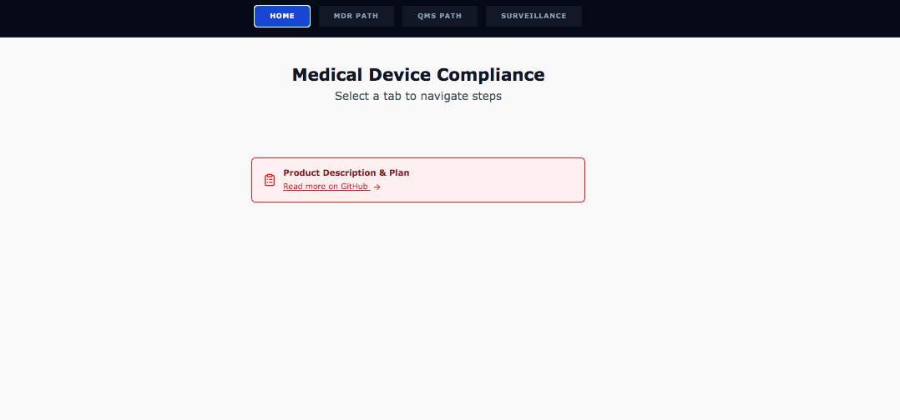
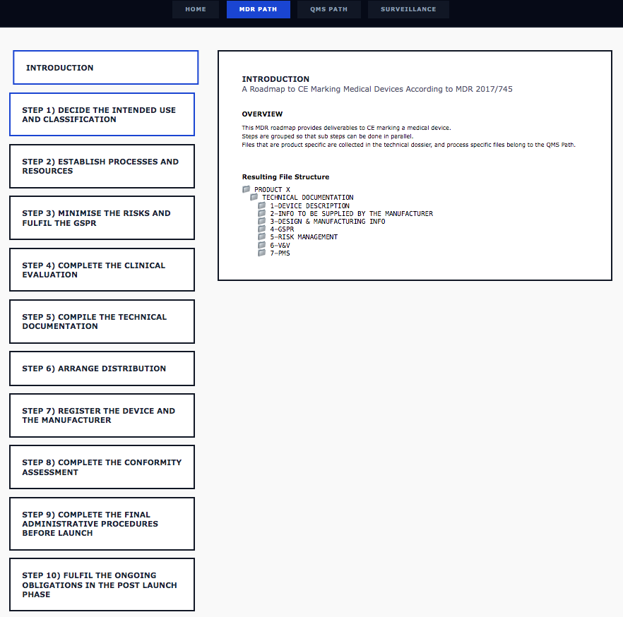
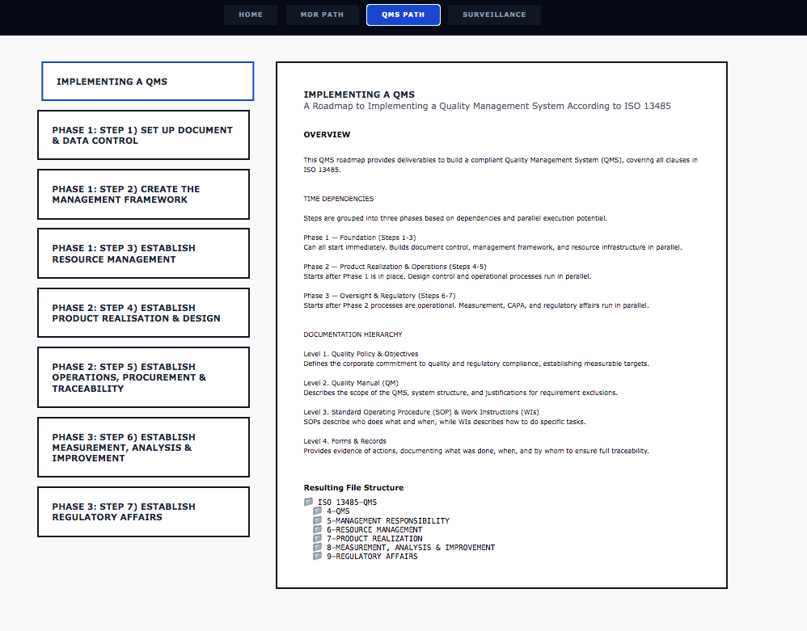

   

# Aegis Compliance App
**A regulatory workflow and post-market surveillance tool for medical device manufacturers**, guiding cross-functional teams — regulatory affairs, quality, data, and leadership — through EU MDR compliance, ISO 13485 QMS setup, and real-world safety signal analysis. 




**Live demo:** [mdr-qms-steps.vercel.app](https://mdr-qms-steps.vercel.app/)
**Data pipeline deep-dive:** [PIPELINE.md](./PIPELINE.md)


---
## Why this exists
Placing a medical device to market — and keeping it there — means navigating regulatory frameworks and continuously monitoring post-market data for safety signals. In practice, this knowledge lives scattered across legal text, SOPs, and spreadsheets.

Aegis Compliance brings these together in one place: the regulatory roadmap, the QMS structure, and a live dashboard built on real FDA adverse event data — so regulatory, quality, and data roles can work from the same picture.


---
## What it does
### MDR Steps

Translates the EU 2017/745 regulation into a visual, navigable roadmap of the CE-marking journey — turning dense legal text into a process a cross-functional team can actually follow.

### QMS Steps

Maps the core requirements of ISO 13485:2016 into a step-by-step implementation guide, with a practical focus on SOPs — a roadmap for startups and manufacturers building an audit-ready QMS from scratch.

### Dashboard — Post-Market Surveillance


A live dashboard built on a custom-engineered data pipeline (see [PIPELINE.md](./PIPELINE.md)) processing FDA MAUDE adverse event data — the kind of dataset manufacturers use to monitor their own products' safety trends over time.

---
## Tech stack
| Layer | Tools |
|---|---|
| Frontend | React |
| Data pipeline | Python, SQL, Pydantic |
| Database | PostgreSQL (Supabase) |
| Deployment | Vercel |


---
## Running it locally
```bash
npm install
npm run dev
```

To rebuild the underlying dataset (ingest → clean → aggregate), follow the steps in [PIPELINE.md](./PIPELINE.md).

---
## Contact
**Malena Grannerud**, malena.grannerud@gmail.com
[LinkedIn](https://www.linkedin.com/in/malena-grannerud)

*Created by Malena Grannerud, 2026*
