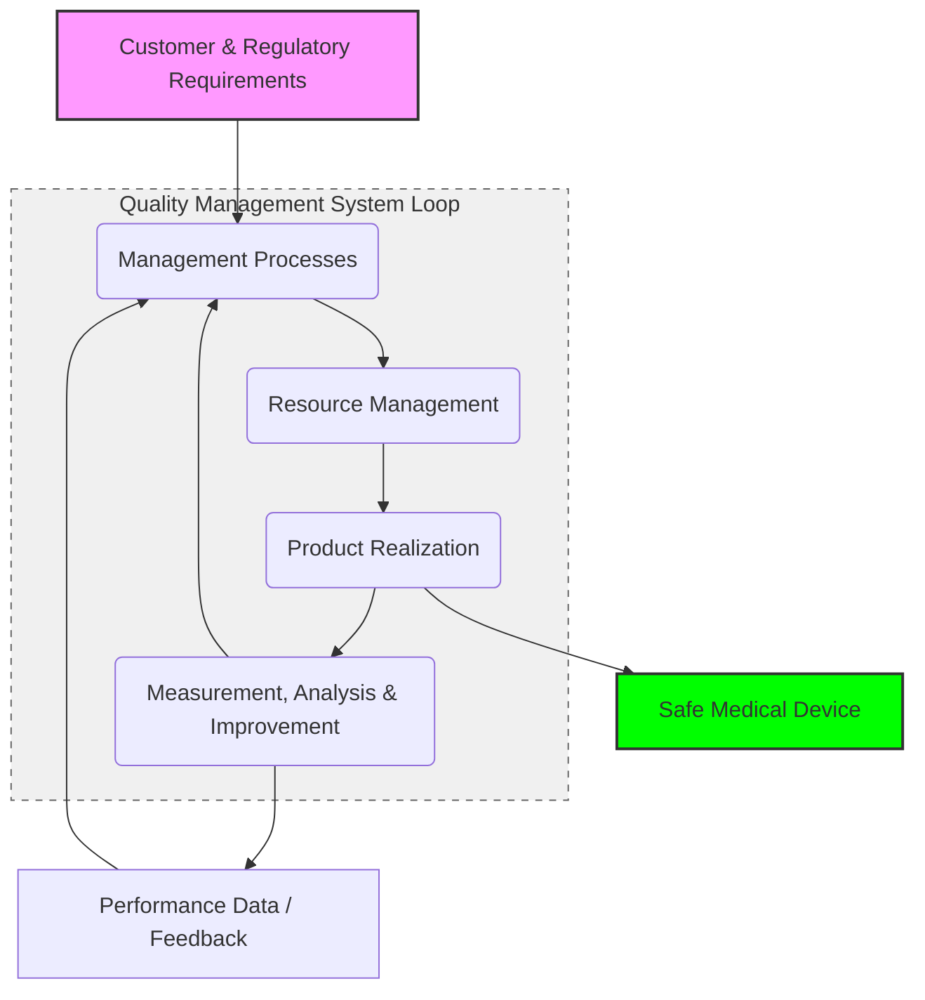

***
# REG-001: MDR Classification Strategy

| Document ID | Version | Date | Status | Owner |
| :--- | :--- | :--- | :--- | :--- |
| REG-001 | 1.0 | 2024-05-22 | Draft | PRRC / RA |

#### 1. PURPOSE
The purpose of this document is to determine and justify the regulatory classification of **[PRODUCT NAME]** in accordance with the EU Medical Device Regulation (MDR) 2017/745, Annex VIII.

#### 2. DEVICE DESCRIPTION & INTENDED PURPOSE
*   **Product Name:** [Name/Model]
*   **Intended Purpose:** [Briefly describe what the device does, e.g., "Software intended for monitoring heart rate in adults in a home environment"].
*   **User Profile:** [e.g., Layperson or Medical Professional].
*   **Duration of Use:** [e.g., Transient (< 60 min), Short-term (< 30 days), or Long-term].

#### 3. CLASSIFICATION 
The classification is based on all rules of MDR Annex VIII.

| Rule Category | Assessment | Status |
| :--- | :--- | :--- |
| **1–4** (Non-invasive devices) | [e.g., Not applicable as the device is active] | - |
| **5–8** (Invasive devices) | [e.g., Not applicable] | - |
| **9–13** (Active devices) | **11:** Software intended to provide information which is used to take decisions with diagnosis or therapeutic purposes... | **Applicable** |
| **Rules 14–22** (Special rules) | [e.g., Not applicable] | - |

#### 4. FINAL CLASSIFICATION  & JUSTIFICATION
Based on the analysis of Annex VIII, the following classification is established:

*   **Risk Class:** Class [I / IIa / IIb / III]
*   **Justification:** The device is classified according to **Rule [X]**. [Provide technical justification, e.g.: "As the software provides data used for diagnostic decisions but not in a critical situation, it falls under Class IIa"].

#### 5. QMS IMPLICATIONS
As a result of (Class [X]), the following requirements apply for market access:
*   **Notified Body involvement:** [YES / NO]
*   **Technical Documentation:** Must comply with MDR Annex II and III.
*   **Post-Market Reporting:** [PMSR (Class I) / PSUR (Class IIa and higher)].

**Signature PRRC:** __________________________  **Date:** __________
***

***
# RPT-001: QMS Scope and Exclusions Report

| Document ID | Version | Date | Status | Owner |
| :--- | :--- | :--- | :--- | :--- |
| RPT-001 | 1.0 | 2024-05-22 | Draft | QA  |

## 1. Purpose
This report defines the boundaries of the QMS for **[Company Name]** and provides the technical justifications for any non-applicability of ISO 13485:2016 requirements.

## 2. QMS Scope
The scope of the QMS includes the **Design, Development, and Distribution** of **[Product Name/Group]**. 
The activities are conducted at the headquarters located in [City, Country]. Manufacturing and logistics are managed through approved sub-contractors under the control of this QMS.

## 3. Product Classification
See `REG-001: MDR Classification Strategy` 

## 4. Justification for Exclusions (Non-Applicability)
In accordance with ISO 13485:2016, Clause 1.2, the following requirements are  not applicable to the organization:

| ISO Clause | Title | Technical Justification |
| :--- | :--- | :--- |
| **7.5.2** | **Cleanliness of product** | The product is a software/standalone electronic device that does not require cleaning before use to ensure safety or performance. No cleaning processes are performed during realization. |
| **7.5.3** | **Installation activities** | The device is installed by the end-user (e.g., via digital download or plug-and-play). No specialized technical installation is required to ensure safe operation. |
| **7.5.4** | **Servicing activities** | No scheduled preventive or corrective servicing is performed on the device. In case of failure, the device is replaced or updated via remote software deployment. |
| **7.5.5** | **Sterile medical devices** | Not sterile. |
| **7.5.7** | **Validation of sterilization** | Not sterile, no sterilization processes are performed or validated by the organization or on its behalf. |
| **7.5.9.2** | **Traceability for implantable devices** | Not implantable. |

## 5. Outsourced Processes
The following processes are outsourced but remain the responsibility of the organization and are controlled through Quality Agreements:
*   Physical Manufacturing (Contract Manufacturer)
*   Global Logistics and Warehousing

**Approved by (QA):** __________________________  **Date:** __________

***

***

# QM-001: QUALITY MANUAL

| Document ID | Version | Date | Status | Owner |
| :--- | :--- | :--- | :--- | :--- |
| QM-001 | 1.0 | 2024-05-22 | Released | CEO / QA Manager |

### 1. INTRODUCTION
This Quality Manual (QM) describes the QMS of **[Company Name]**. It serves as the high-level roadmap to ensure our medical devices consistently meet customer requirements and applicable regulatory standards (ISO 13485:2016 and MDR 2017/745).

## 2. SCOPE (ISO 4.2.2 a)
The scope of this QMS includes the design, development, and distribution of **[Product Name/Group]**. 

*   **Regulatory Classification:** See `REG-001: MDR Classification Strategy`.
*   **Exclusions:** See `RPT-001: Scope and Exclusions Report`.

## 3. Terms and Definitions
The QMS adopts the definitions from **ISO 13485:2016** and **ISO 9000:2015**. 
*   *Refer to: `TERMS_ISO_13485.md` and `TERMS_ISO_9000.md`.*

## 4. QMS (ISO 4.0)
### 4.1 General Requirements
[Company Name] has established a risk-based QMS. We control all internal and outsourced processes that affect product conformity.

### 4.2 Documentation Requirements (Structure)
Our documentation hierarchy consists of:
1.  **Level 1: Quality Manual** (This document)
2.  **Level 2: SOPs** (Standard Operating Procedures)
3.  **Level 3: Work Instructions & Templates**
4.  **Level 4: Records** (Evidence of activities)

## 5. Management Responsibility (ISO 5.0)
Top Management is actively committed to the development and maintenance of the QMS by:
*   Establishing and signing the **Quality Policy**.
*   Ensuring measurable **Quality Objectives** are set and monitored.
*   Conducting annual **Management Reviews** to evaluate QMS effectiveness.
*   Appointing a **Person Responsible for Regulatory Compliance (PRRC)**.
*   Ensuring the availability of necessary resources.

## 6. Process Interactions Map (ISO 4.2.2 c)

### 6.1 Process Groups and Ownership
The following table defines the core process groups, their owners, and the main activities involved.

| Process Group (Owner) | Main Processes | ISO Clause |
| :--- | :--- | :--- | 
| Management Processes (CEO) | Quality Planning, Management Review, Internal/External Communication |  5.0 |
| Resource Management (Operations/HR) ) | HR, Training, Infrastructure, IT Maintenance |  6.0 |
| Product Realization (CTO) | Design & Development, Risk Management (ISO 14971), Purchasing, Production/Service | 7.0 |
| Measurement Analysis & Improvement (QA/RA) | PMS, Complaint Handling, Internal Audits, CAPA | 8.0 |

### 6.2 Interaction Diagram

## 7. Cross-Reference Matrix (ISO 4.2.2 b)
This matrix maps ISO 13485:2016 clauses to our internal Standard Operating Procedures (SOPs).

| ISO 13485 Clause | Title | Internal SOP / Reference |
| :--- | :--- | :--- |
| **4.2.3 / 4.2.4** | Control of Documents & Records | SOP-001 Document Control |
| **5.0** | Management Processes (All 5.x) | SOP-002 Management Processes |
| **6.0** | Resource Management (All 6.x) | SOP-003 Resource Management |
| **7.3** | Design and Development | SOP-004 Design Control |
| **7.4** | Purchasing / Suppliers | SOP-005 Purchasing |
| **8.2.1 / 8.3.3** | PMS & Complaints | SOP-008 Post-Market Surveillance |

**Approved by (CEO):** __________________________  **Date:** __________

***

